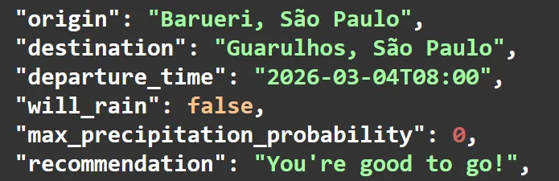

# Will It Rain? 🌧️


> **Don't just check the weather at your destination. Check it along the way.**

A REST API with a web interface that tells you whether it will rain **during your journey** — not just at your destination. Given an origin, destination, and departure time, it maps your route, estimates when you'll reach each point, and checks the forecast at the right time for each location.



---

## The Problem

Most weather apps check a single location at a single time. But if you're driving 2 hours across the city, rain at your destination in 30 minutes doesn't mean you'll get wet — and clear skies now doesn't mean you'll stay dry. **Will It Rain?** solves this by treating your route as a timeline, not a single point.

---

## How It Works

```
Origin + Destination + Departure Time
          ↓
  Geocoding (Nominatim)
  Converts addresses → coordinates
          ↓
  Routing (OpenRouteService)
  Calculates full route + total duration
          ↓
  Route Segmentation
  Splits route into dynamic points based on distance
  Estimates arrival time at each point
          ↓
  Weather Forecast (Open-Meteo)
  Queries precipitation at each point
  at the correct estimated time
          ↓
  Result: max precipitation probability
  + recommendation
```

---

## Features

- **Route-aware forecasting** — checks weather at each point along the route, not just origin or destination
- **Time-accurate predictions** — estimates when you'll actually reach each point based on total trip duration
- **Dynamic route sampling** — number of points scales with distance (1 point per 20km, min 5, max 25)
- **Efficient API usage** — fetches all weather data in a single Open-Meteo request
- **Clear recommendation** — returns `"Take an umbrella!"` or `"You're good to go!"`
- **Web interface** — clean, minimal frontend to use without touching the API directly
- **Secure config** — API keys managed via `.env` with `.env.example` provided

---

## Architecture

```
Will_It_Rain/
├── backend/
│   ├── main.py          # FastAPI app, endpoint definition and orchestration
│   ├── geocoding.py     # Address → coordinates via Nominatim
│   ├── route.py         # Route calculation and point segmentation via OpenRouteService
│   └── weather.py       # Precipitation forecast via Open-Meteo
├── frontend/
│   ├── index.html       # Web interface
│   ├── style.css        # Styles
│   └── script.js        # API integration and DOM rendering
├── assets/
├── .env.example
└── .gitignore
```

Each backend module has a single responsibility. `main.py` orchestrates the pipeline; the other three are independent, testable services.

---

## Setup

**Prerequisites:**
- Python 3.13+
- Free API key from [OpenRouteService](https://openrouteservice.org/)

**Install:**

```bash
git clone https://github.com/EduardoCassanha/Will-It-Rain-.git
cd Will_It_Rain
pip install fastapi uvicorn requests python-dotenv
```

**Configure:**

```bash
cp .env.example .env
# Add your OpenRouteService API key to .env
```

**Run the API:**

```bash
python -m uvicorn backend.main:app --reload
```

Open `http://127.0.0.1:8000/docs` to explore and test the API via Swagger UI.

**Run the frontend:**

```bash
cd frontend
python -m http.server 3000
```

Open `http://localhost:3000` in your browser.

---

## Usage

**`POST /check-rain`**

```json
{
  "origin": "Barueri, São Paulo",
  "destination": "Guarulhos, São Paulo",
  "departure_time": "2026-03-04T08:00"
}
```

`departure_time` is optional — if omitted, the current time is used.

**Response:**

```json
{
  "origin": "Barueri, São Paulo",
  "destination": "Guarulhos, São Paulo",
  "departure_time": "2026-03-04T08:00",
  "will_rain": false,
  "max_precipitation_probability": 12,
  "recommendation": "You're good to go!",
  "route_weather": [...]
}
```

---

## APIs Used

| Service | Purpose |
|---|---|
| [Nominatim](https://nominatim.org/) | Geocoding — address to coordinates |
| [OpenRouteService](https://openrouteservice.org/) | Routing — path and duration |
| [Open-Meteo](https://open-meteo.com/) | Weather forecast — precipitation per point |

---

## Design Notes

- **Single weather request** — all forecast queries are batched into one Open-Meteo call to minimize latency and respect rate limits
- **Dynamic route points** — scales with distance: 1 point per 20km, minimum 5, maximum 25
- **Time estimation** — arrival time at each point is linearly interpolated from total trip duration; no real-time traffic data
- **Past date protection** — API rejects departure times more than 5 minutes in the past

---

## License

No license applied. All rights reserved.